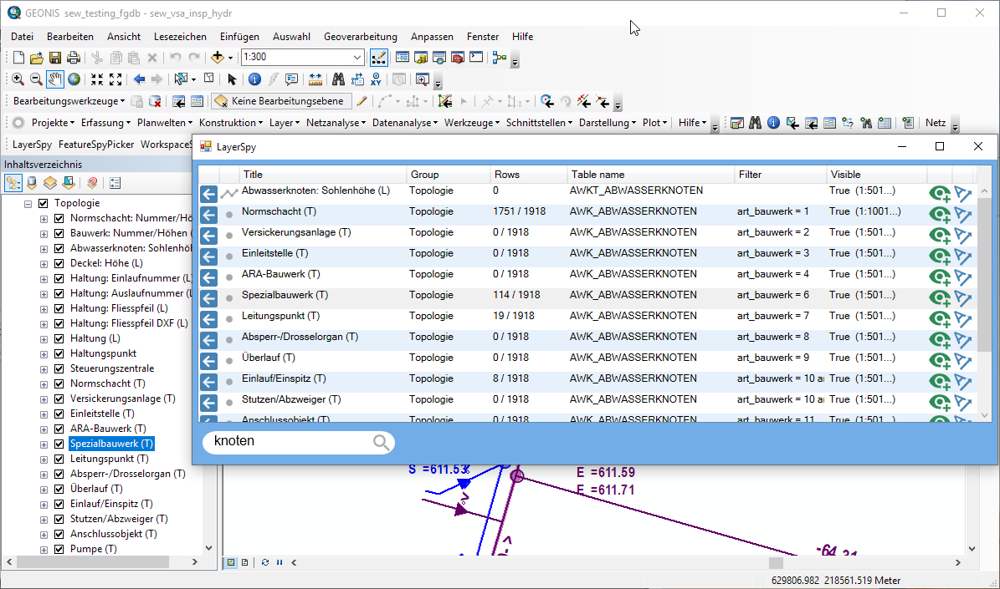
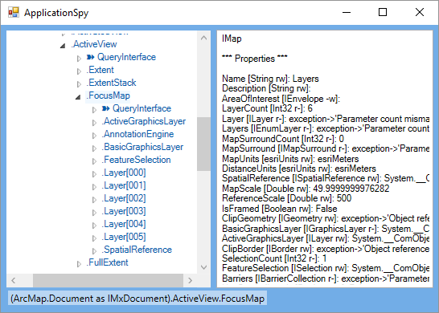
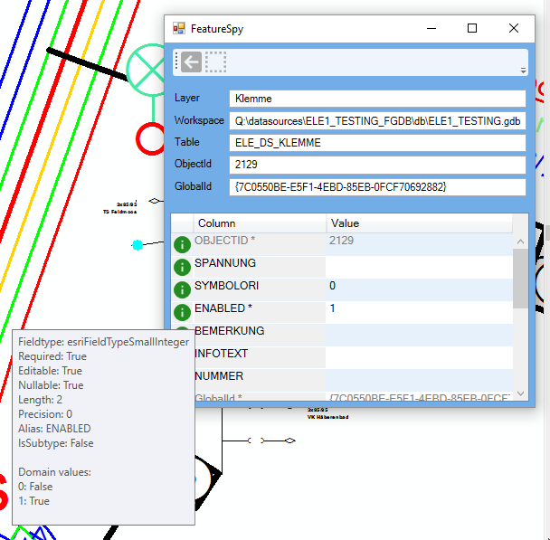
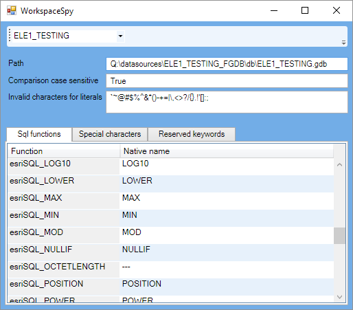

# ArcmapSpy

ArcmapSpy is an AddIn for the Esri ArcMap software and provides insight into the internas of ArcObjects. It consists of several tools which are listed below, they are accessible from a stand-alone toolbar.

You can [download the latest version](https://github.com/geocom-gis/ArcmapSpy/releases/latest) of ArcmapSpy in the release section.

For more information please contact: support@geocom.ch.

#### DISCLAMER: Please be aware that this product is not supported. Further information can be found in the license file.

------
## Requirements

Since this is an AddIn for the ArcGIS desktop, an installed version of ArcMap 10.5 or higher is required.

------
## Tools

### LayerSpy

Offers a full text search on the layers in the ArcMap table of content (TOC). This way you can easily find all layers belonging to a given database table and can jump to the layer (expand and select in TOC). It also gives an overview on the number of existing rows and shows whether a filter is active.

### ApplicationSpy

This tool is especially useful for developers which want to dig deeper into the object tree of ArcObjects. Sometimes it is difficult to understand the documentation, because it is not clear in what other interfaces a COM object can be casted in reality. This tool can discover relationships between Esri Interfaces and CoClasses. The property/queryinterface path can be copied from the status bar.

### FeatureSpy

Examines a single feature like the ArcMap tool does, but offers a convenient pick tool and shows helpful information about the table structure (like data type, required flag, domain values, ...).

### WorkspaceSpy

Provides useful information about the currently open workspaces. Here you can find a list of supported SQL functions, reserved words, and more.

------
## Installation and compilation

The latest version of ArcmapSpy can be downloaded from the release section. A double click will install the AddIn in ArcMap.

To build the AddIn from scratch:
1. Open the solution in VisualStudio with administrator privileges. VisualStudio 2015 is required when using the ArcMap 10.5 Dotnet SDK, other versions may be required when using different SDKs. The admin privileges are required, when the AddIn should be registered after compilation.
2. If you host the ArcMap dlls in a dedicated directory, edit the ArcmapSpy.csproj file and let the variable <ArcmapDllPath> point to this directory. The default directory is the standard path of an installed ArcMap 10.5.
3. Build the project.
4. Run ArcMap, a new toolbar should be available.
  
------
## Known issues
